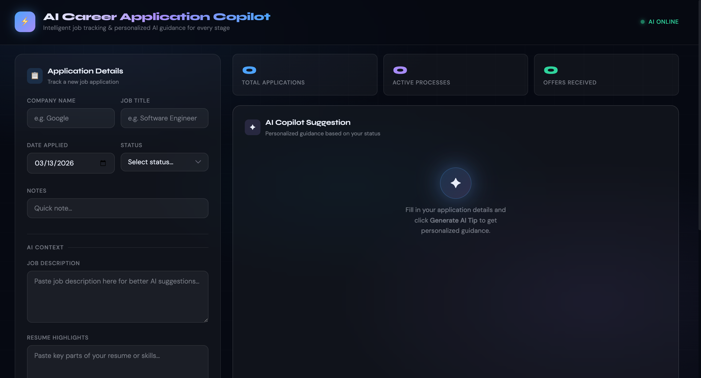
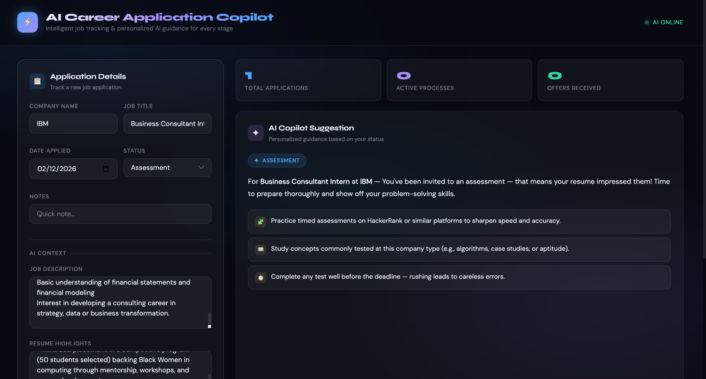
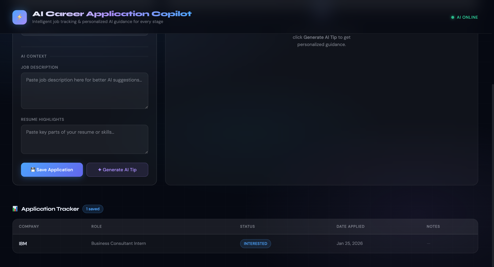

# AI Career Application Copilot

## Overview

AI Career Application Copilot is a front-end prototype of an AI-powered system designed to help job seekers manage and track their job applications. The interface allows users to log applications, monitor their progress through different hiring stages, and receive AI-generated suggestions for next steps.

This project was developed as part of an **AI Agentic Systems course**. For **Milestone I**, the focus is on building the **user-facing interface** that allows users to interact with the system.

The current version simulates AI recommendations using simple rule-based logic. In future milestones, the system will be expanded to include a **multi-agent workflow** capable of performing more advanced tasks such as resume optimization, job matching, interview preparation guidance, and automated follow-up recommendations.

---

## User Interface

The application is designed as a **dashboard-style interface** that organizes job application management into three main sections.

### Application Input Panel

Users can enter job application details including:

- Company name  
- Job title  
- Date applied  
- Application status  
- Notes about the role  

Users can also paste:

- Job description text  
- Resume text  

These inputs will later be used by AI agents to analyze job fit and provide personalized recommendations.

---

### AI Suggestion Panel

The interface includes a panel where the system generates **next-step guidance** based on the application status selected by the user.

Example suggestions include:

- **Applied** → Suggest sending a follow-up message after several days  
- **Assessment** → Recommend preparing for technical or behavioral assessments  
- **Interview** → Suggest reviewing company information and preparing interview responses  
- **Offer** → Suggest evaluating compensation, benefits, and timeline  
- **Rejected** → Encourage applying to similar roles  

For this milestone, suggestions are generated using **JavaScript logic to simulate AI recommendations**.

---

### Application Tracker Dashboard

Saved job applications appear in a table that allows users to track their progress through the hiring pipeline.

The tracker displays:

- Company  
- Job title  
- Application status  
- Date applied  
- Notes  

This provides a simple dashboard for organizing multiple job applications.

---

## Screenshots

## Screenshots

### Dashboard Interface

### AI Copilot Suggestion

### Application Tracker Example

---

## Technology Stack

The front-end prototype was built using the following technologies:

**HTML**  
Used to structure the layout and content of the user interface.

**CSS**  
Used to design the visual appearance of the dashboard, including the dark, modern interface styling.

**JavaScript**  
Used to implement front-end logic and interactions, including:

- generating next-step recommendations
- saving applications to the tracker table
- handling form input and button actions

All functionality is contained within a **single HTML file**, allowing the prototype to run easily in any web browser without additional setup.

---

## How to Run the Project

1. Download or clone the repository.

2. Open the file:

3. Open the file in any modern web browser.

No installation or additional setup is required.

---

## Future Improvements

Future milestones will expand this prototype into a full **AI agentic system**, including:

- multi-agent workflow architecture
- resume optimization agent
- interview preparation agent
- job description analysis
- automated follow-up reminders
- persistent storage for applications
- advanced recommendation systems

---

## Project Goal

The goal of this project is to demonstrate how **AI agents can support users throughout the job application process**, helping them track opportunities, stay organized, and receive intelligent recommendations about next steps.
